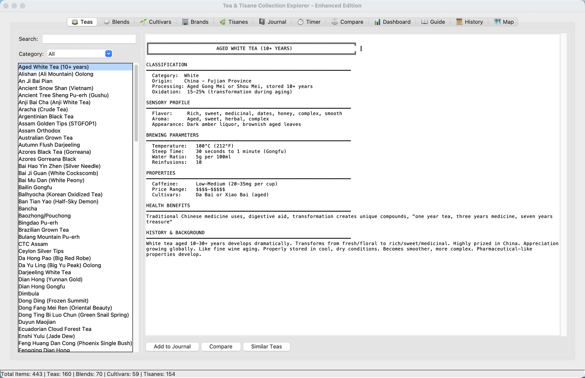
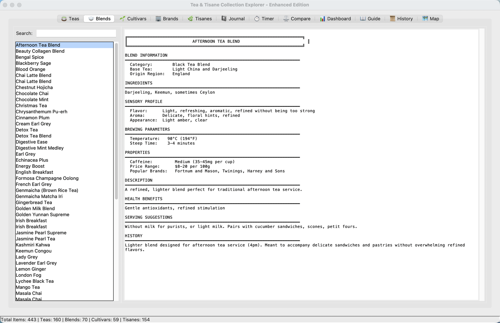
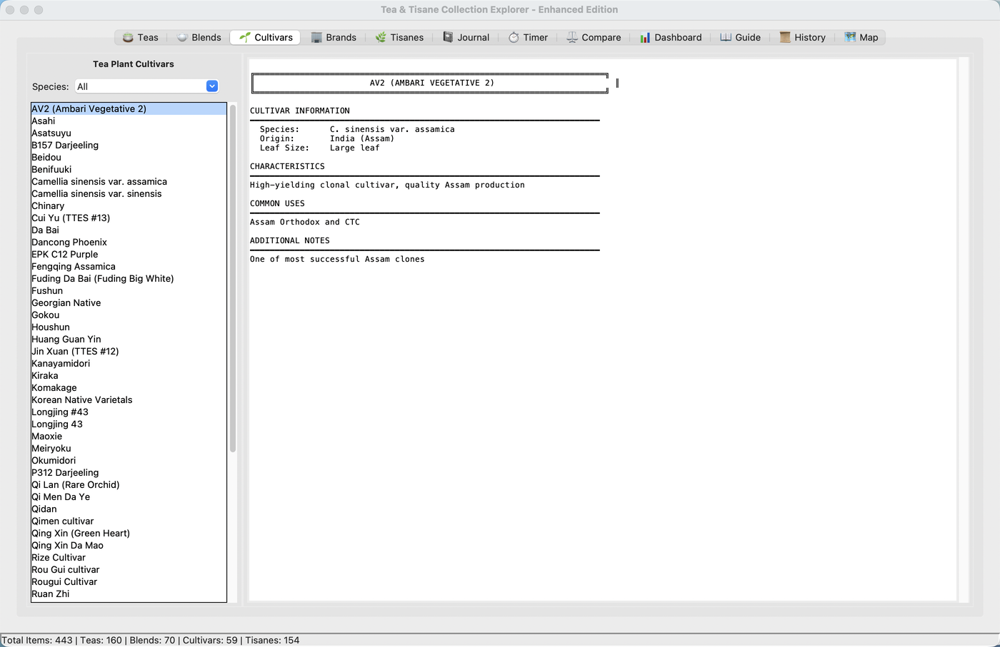
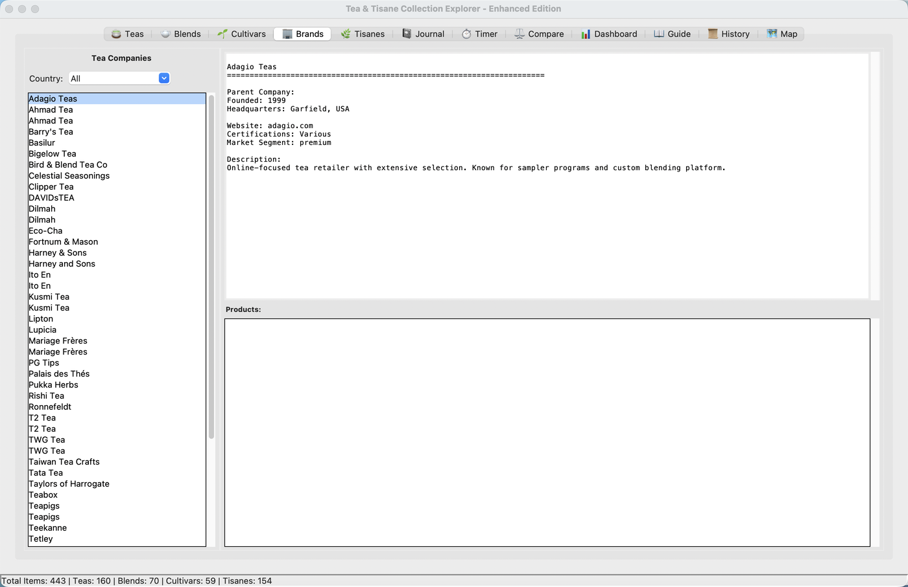
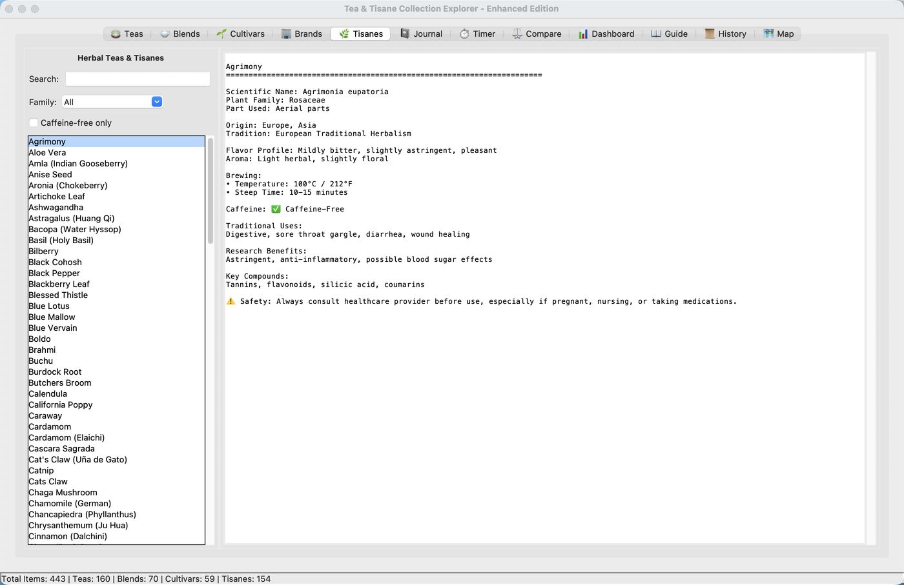
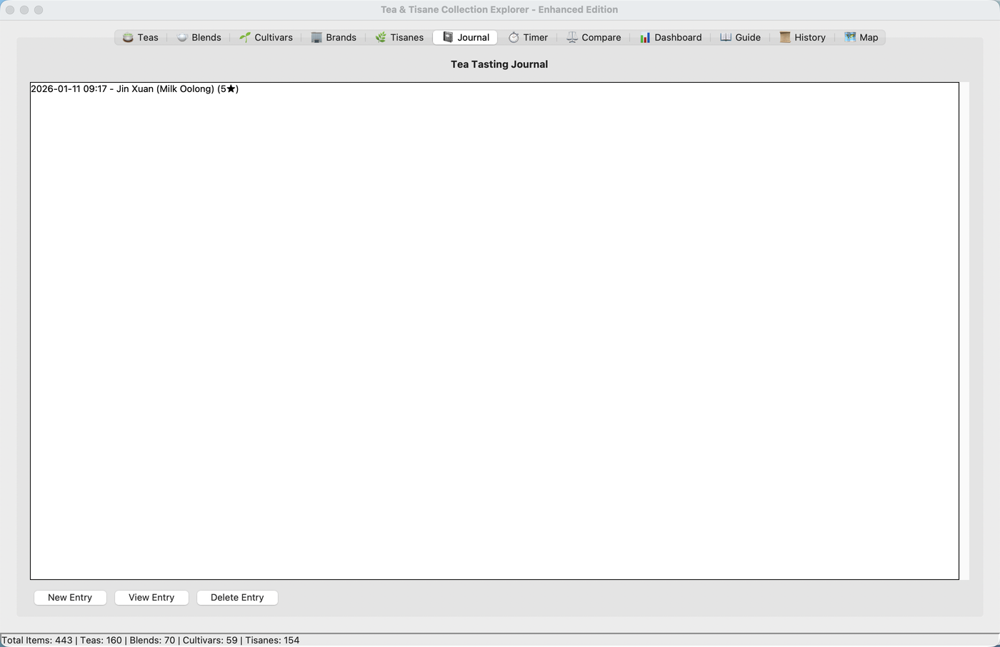
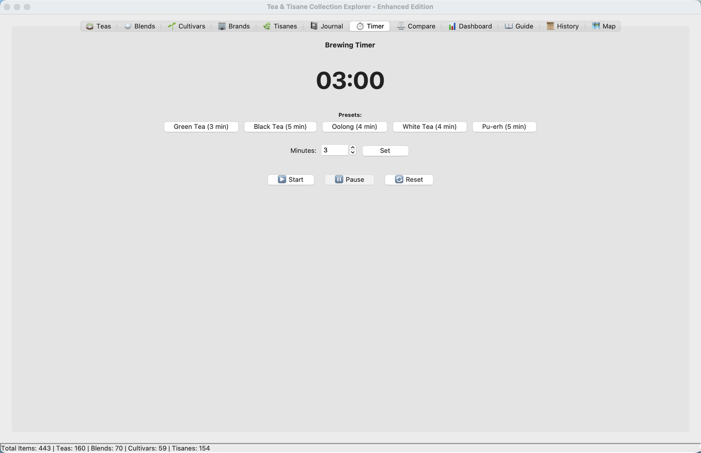
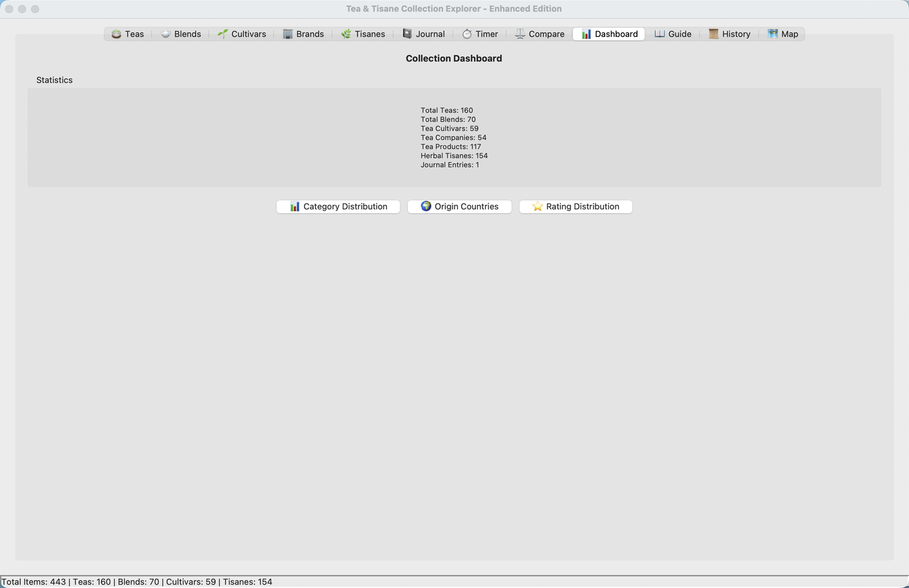
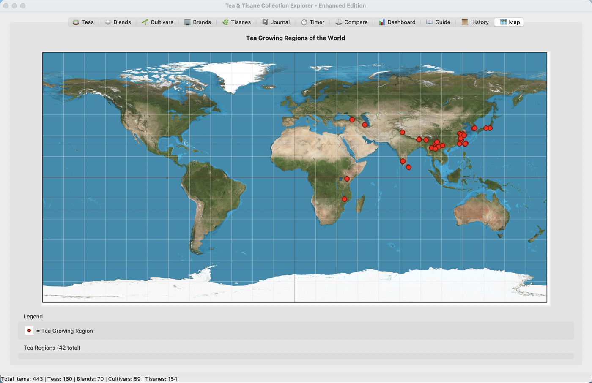

# Tea & Tisane Collection Explorer

A comprehensive desktop application for exploring, organizing, and learning about teas, blends, cultivars, tisanes, and tea companies from around the world. Built with Python and Tkinter using a clean MVC architecture.



## Features

### Tea Browser
Browse 160+ tea varieties from the Camellia sinensis plant. Search by name or filter by category (White, Green, Yellow, Oolong, Black, Pu-erh). Each tea includes detailed information on origin, processing, flavor profiles, brewing parameters, health benefits, and history.


### Blends Browser
Explore 70+ tea blends and flavored teas with ingredient lists, serving suggestions, popular brands, and complete brewing instructions.



### Cultivars Browser
Learn about 59 tea plant cultivars, filterable by species (Camellia sinensis var. sinensis, var. assamica). Includes leaf characteristics, origin information, growing conditions, and common uses.



### Brands & Products
Browse tea companies and their product catalogs, filterable by country. Includes company details (headquarters, founding year, certifications, market segment) and product listings.



### Tisanes (Herbal Teas)
Discover 154 herbal infusions with scientific names, traditional uses, health benefits, key compounds, and safety information. Filter by plant family or caffeine-free status.



### Tea Journal
Record your tea tasting experiences with ratings (1-5 stars), brewing parameters, and tasting notes. Quick-add entries directly from the tea browser.



### Brewing Timer
Built-in timer with presets for Green (3 min), Black (5 min), Oolong (4 min), White (4 min), and Pu-erh (5 min). Supports manual time setting and alerts when brewing is complete.



### Tea Comparison
Compare up to 3 teas side-by-side on category, origin, caffeine level, steep time, and temperature.

### Dashboard & Visualizations
Collection statistics with interactive charts: category distribution (pie chart), origin countries (bar chart), and journal rating distribution (histogram). Powered by Matplotlib.



### World Map
Interactive map showing tea-growing regions around the world with markers and a region directory grouped by country.



### Additional Features
- **Tea Varieties Guide** - Comprehensive reference covering 200+ varieties
- **Tea History** - Cultural and historical background of tea
- **Tea Glossary** - Terminology reference (via Help menu)
- **Theme Support** - Light, Dark, and Tea-inspired color schemes
- **Export** - Export your collection to CSV or JSON
- **Smart Recommendations** - Find similar teas based on category, origin, and flavor profiles

## Database Contents

| Category | Count |
|----------|-------|
| Tea Varieties | 160 |
| Tea Blends | 70 |
| Cultivars | 59 |
| Tea Companies | 28+ |
| Products | 117+ |
| Herbal Tisanes | 154 |
| Growing Regions | 12 |

**Total: 443+ items** across two SQLite databases

## Quick Start

### 1. Install Dependencies

```bash
pip install -r requirements.txt
```

Required packages: `matplotlib`, `Pillow`, `numpy`

Tkinter is included with most Python installations.

### 2. Set Up the Database

```bash
python setup_database.py
```

### 3. Run the Application

```bash
python main.py
```

## Project Structure

```
tea_explorer/
├── main.py                      # Application entry point
├── config.py                    # Configuration management
├── logger_setup.py              # Logging system
├── validation.py                # Input validation
│
├── models/                      # Domain objects
│   ├── tea.py                   # Tea dataclass
│   ├── blend.py                 # Blend dataclass
│   ├── journal_entry.py         # Journal entry with ratings
│   ├── cultivar.py              # Tea plant cultivar
│   ├── company.py               # Tea company
│   ├── tisane.py                # Herbal tisane
│   └── region.py                # Tea growing region
│
├── database/                    # Data access layer
│   ├── connection.py            # Connection manager
│   ├── tea_repository.py        # Tea data access
│   ├── blend_repository.py      # Blend data access
│   ├── journal_repository.py    # Journal (JSON storage)
│   ├── cultivar_repository.py   # Cultivar data access
│   ├── company_repository.py    # Company data access
│   ├── tisane_repository.py     # Tisane data access
│   └── region_repository.py     # Region data access
│
├── controllers/                 # Business logic
│   ├── tea_controller.py        # Tea operations
│   ├── blend_controller.py      # Blend operations
│   ├── journal_controller.py    # Journal operations
│   ├── cultivar_controller.py   # Cultivar operations
│   ├── company_controller.py    # Company operations
│   └── tisane_controller.py     # Tisane operations
│
├── views/                       # UI components
│   ├── main_window.py           # Main application window
│   ├── widgets/                 # Reusable widgets
│   │   ├── search_panel.py
│   │   ├── list_panel.py
│   │   └── detail_panel.py
│   └── tabs/                    # Tab implementations
│       ├── base_tab.py
│       └── tea_tab.py
│
├── services/                    # Business services
│   └── export_service.py        # CSV/JSON export
│
├── themes/                      # Theme system
│   └── theme_manager.py         # Dark/Light/Tea themes
│
├── visualizations/              # Charts and analytics
│   └── chart_generator.py       # Matplotlib charts
│
├── recommendations/             # Smart suggestions
│   └── engine.py                # Recommendation engine
│
├── performance/                 # Performance tools
│   ├── cache.py                 # Caching system
│   └── profiler.py              # Performance monitor
│
├── utils/                       # Utilities
│   └── formatters.py            # Formatting helpers
│
├── tests/                       # Test suite
│   └── test_models.py           # Model tests
│
├── tea_collection.db            # Main tea database (SQLite)
├── tisane_collection.db         # Tisane database (SQLite)
├── tea_journal.json             # Journal entries
├── tea_varieties_list.md        # Tea varieties guide
├── tea_history.md               # Tea history reference
├── tea_glossary.md              # Terminology glossary
├── tisanes.md                   # Tisane reference
├── world_map_bg.png             # World map background
├── theme_config.json            # Theme preferences
├── requirements.txt             # Python dependencies
└── screenshots/                 # Application screenshots
```

## Architecture

The application follows the **MVC (Model-View-Controller)** pattern with a **Repository** data access layer:

```
User Input --> View --> Controller --> Repository --> Database
                 ^          |
               Models    Business Logic
```

- **Models** - Type-safe dataclasses with validation
- **Repositories** - Data access using the Repository pattern
- **Controllers** - Business logic and data coordination
- **Views** - Tkinter UI components
- **Services** - Cross-cutting concerns (export, recommendations)

## Configuration

Configuration is managed through `config.py` with environment variable support:

| Variable | Default | Description |
|----------|---------|-------------|
| `TEA_DB_PATH` | `tea_collection.db` | Tea database path |
| `TISANE_DB_PATH` | `tisane_collection.db` | Tisane database path |
| `WINDOW_WIDTH` | `1400` | Window width |
| `WINDOW_HEIGHT` | `900` | Window height |
| `THEME` | `light` | Theme (light/dark/tea) |
| `LOG_LEVEL` | `INFO` | Logging level |

## Testing

```bash
# Run all tests
pytest tests/ -v

# With coverage
pytest tests/ -v --cov=. --cov-report=html
```

## License

This is a reference implementation for educational purposes.
